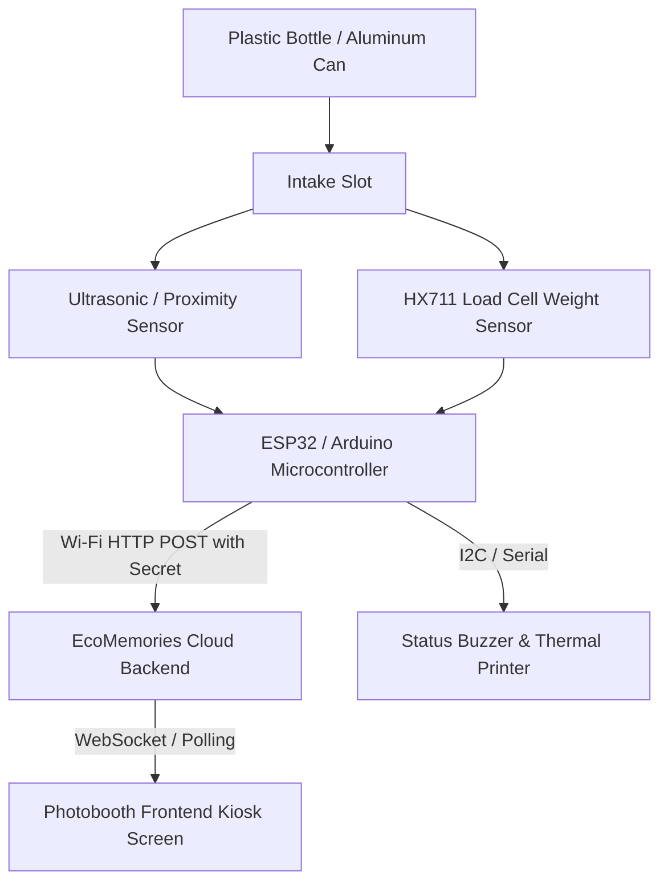

# EcoMemories — Hardware & IoT Integration Guide

> **Technical specification for connecting physical Arduino / ESP32 sensors to the EcoMemories backend.**

---

## 📡 1. Device Event Endpoint

The backend provides a dedicated endpoint for hardware events adhering to the idempotency and audit specifications:

```http
POST /api/devices/events
Content-Type: application/json
X-Device-Secret: YOUR_HARDWARE_SECRET_KEY
```

### JSON Request Payload

```json
{
  "device_id": "SIMULATOR-001",
  "event": "deposit",
  "event_id": "evt_550e8400-e29b-41d4-a716-446655440000",
  "session_code": "VITSGD",
  "weight": 18.5
}
```

### Parameter Reference

| Field | Type | Description |
| :--- | :--- | :--- |
| `device_id` | `string` | Unique hardware identifier registered in the database (e.g. `SIMULATOR-001` or `KIOSK-NORTH-01`). |
| `event` | `string` | Must be `"deposit"`. |
| `event_id` | `string` | Unique UUID generated by the microcontroller for each physical deposit (prevents duplicate counting if retried). |
| `session_code` | `string` | The active session code displayed on the kiosk screen (e.g., `VITSGD`). |
| `weight` | `float` | *(Optional)* Measured weight in grams from the load cell sensor. |

---

## ⚡ 2. HTTP Responses

### Success Response (200 OK)

```json
{
  "success": true,
  "deposit": {
    "id": 14,
    "status": "valid"
  },
  "reward_earned": true,
  "session": {
    "deposits": 5,
    "required": 5,
    "credits": 1
  }
}
```

### Error Responses

| Status Code | Reason | Hardware Action |
| :--- | :--- | :--- |
| `401 Unauthorized` | Invalid `X-Device-Secret` header | Check pre-shared key stored in firmware. |
| `403 Forbidden` | Device inactive or unregistered | Register device in database `devices` table. |
| `404 Not Found` | Session code does not exist or has expired | Display "Scan QR or Start New Session" on kiosk LCD. |
| `409 Conflict` | Duplicate `event_id` received (already logged) | Acknowledge as success; do not increment internal counter. |

---

## 🔌 3. Recommended Hardware Architecture



### Sensor Specifications
1. **Intake Weight (HX711 + Load Cell)**:
   * Plastic Bottle: ~9g – 35g
   * Aluminum Can: ~12g – 20g
   * *Threshold Filter*: Ignore items < 5g (spurious vibrations) and > 200g (heavy objects/liquid residue).
2. **Proximity Trigger (HC-SR04 or IR Obstacle Sensor)**:
   * Detects object insertion and triggers the weight read cycle.
3. **Audio-Visual Feedback**:
   * **Buzzer Short Beep**: Item accepted & logged.
   * **Buzzer Double Long Tone**: Session credit unlocked (5th item).

---

## 📦 4. Sample ESP32 / C++ Firmware Snippet

```cpp
#include <WiFi.h>
#include <HTTPClient.h>
#include <ArduinoJson.h>

const char* ssid = "YOUR_WIFI_SSID";
const char* password = "YOUR_WIFI_PASSWORD";
const char* serverUrl = "https://your-domain.com/api/devices/events";
const char* deviceSecret = "YOUR_HARDWARE_SECRET_KEY";

void sendDepositEvent(String sessionCode, float measuredWeight) {
    if (WiFi.status() != WL_CONNECTED) {
        // Queue event in local flash memory for retry
        return;
    }

    HTTPClient http;
    http.begin(serverUrl);
    http.addHeader("Content-Type", "application/json");
    http.addHeader("X-Device-Secret", deviceSecret);

    // Generate unique UUID/event_id
    String eventId = "evt_" + String((uint32_t)ESP.getEfuseMac(), HEX) + "_" + String(millis());

    StaticJsonDocument<256> doc;
    doc["device_id"] = "KIOSK-001";
    doc["event"] = "deposit";
    doc["event_id"] = eventId;
    doc["session_code"] = sessionCode;
    doc["weight"] = measuredWeight;

    String requestBody;
    serializeJson(doc, requestBody);

    int httpResponseCode = http.POST(requestBody);
    if (httpResponseCode == 200) {
        String response = http.getString();
        Serial.println("Deposit verified: " + response);
        // Play success beep
    } else {
        Serial.printf("Error sending deposit: %d\n", httpResponseCode);
    }
    http.end();
}
```
