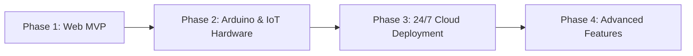

# EcoMemories — Project Overview & Roadmap

> **An autonomous IoT smart recycling reward station and 4-pose souvenir photobooth.**  
> *"Turn waste into lasting memories."*

---

## 📌 Executive Summary

**EcoMemories** bridges environmental stewardship with community engagement. Users deposit recyclable items (clean PET plastic bottles and aluminum beverage cans) into a smart intake kiosk. Once **5 valid items** are verified by hardware weight/proximity sensors, the station unlocks **1 photobooth session credit**, allowing users to capture an artisan 4-pose photostrip with live countdowns, multi-theme customization, physical thermal receipt simulation, and instant QR code keepsake retrieval.

---

## 🎨 Visual Identity & Design System

The user interface follows an **editorial, humanistic aesthetic** inspired by modern high-craft digital design:

| Element | Specification | Purpose |
| :--- | :--- | :--- |
| **Canvas Background** | `#FAF8F5` Warm Sand with subtle dot grid | Natural, tactile paper-like feel |
| **Primary Brand** | `#0E3E2B` Deep Forest Green | Environmental anchor & prestige |
| **Accent Tone** | `#C5A059` Warm Gold / `#D4AF37` Light Gold | Celebration & reward highlights |
| **Typography** | `Newsreader` / Serif Headlines + `JetBrains Mono` Tags | Editorial contrast & hardware kiosk cues |
| **Animations** | Hardware-accelerated Canvas confetti, smooth scale transitions | High-performance 60fps across mobile & desktop |

---

## 🏆 What Has Been Achieved So Far (Milestones)

### 1. Rebranding & Architectural Foundation
- [x] Complete rebranding from *EcoPhotobooth* to **EcoMemories** across all frontend views, database seeds, documentation, canvas compositor, and public metadata.
- [x] Full single-page application routing in React 19 with Laravel 11 Blade hybrid loader.

### 2. Complete 5-Stage User Journey
- [x] **Welcome Page (`/`)**: Bento card architecture (3-step experience), high-contrast hero typography, live hardware status indicators.
- [x] **Session Page (`/session/:sessionCode`)**: Circular progress ring, real-time deposit counter, celebratory canvas confetti explosion upon unlocking credit, intake history logs, and a 3-minute kiosk inactivity auto-reset.
- [x] **4-Pose Camera Booth (`/session/:sessionCode/camera`)**: Live camera stream with countdown overlays, custom pose prompts ("Smile for the Planet", "Thumbs Up", etc.), live thumbnail sidebar, individual shot retakes, and an instant test generator mode.
- [x] **Artisan Customizer (`/session/:sessionCode/camera`)**: Dynamic Canvas compositor with 2 layout formats (Classic 2x6 Strip vs 2x2 Grid) and 4 artisan themes (*Emerald Forest, Eco Kraft, Midnight Minimal, Luminous Sand*).
- [x] **Result & Keepsake Page (`/session/:sessionCode/result` & `/photo/:reference`)**: High-res photostrip preview, QR code generator for phone access, simulated thermal ticket receipt, and direct image download.

### 3. Data Privacy, Compliance & Security Suite
- [x] **Privacy Policy (`/privacy`)**: Detailed clauses covering camera safety (no background surveillance, no facial recognition), non-PII telemetry metrics, and storage practices.
- [x] **Terms of Use & Kiosk Safety (`/terms`)**: Material guidelines (Accepted PET plastics/cans vs Prohibited hazards) and kiosk usage rules.
- [x] **GDPR / CCPA Right to Erasure**:
  - Direct "Request Data Erasure / Delete Photo" action with confirmation modal on `/photo/:reference`.
  - Self-Service Erasure Portal in `/privacy` to purge photos via reference code.
- [x] **Security Hardening**:
  - **Randomized Reference Codes**: Replaced sequential IDs with cryptographically secure 6-character uppercase codes (e.g. `ECO-PSMDKU`, 2.1B+ permutations).
  - **Upload Payload Limits**: 10MB base64 ceiling and binary header validation in `PhotoController`.
  - **HTTP Security Headers**: Injected `X-Content-Type-Options: nosniff`, `X-Frame-Options: SAMEORIGIN`, and `Referrer-Policy: strict-origin-when-cross-origin`.
  - **API Rate Limiting**: Added `throttle:60,1` against brute-force enumeration.
  - **IoT Device Authentication**: Added `X-Device-Secret` header validation in `DeviceEventController`.

### 4. Performance & Mobile Responsiveness
- [x] Fluid clamp typography and responsive container scaling for mobile (375px), tablet (768px), and desktop (1280px+).
- [x] Replaced CPU-heavy DOM confetti with an ultra-smooth, battery-efficient **HTML5 Canvas 60fps confetti engine**.
- [x] Hybrid asset loader in `app.blade.php` dynamically serving compiled production builds over Cloudflare Tunnels while maintaining HMR for direct localhost.

---

## 📋 What To Do Next (Roadmap & Action Items)

### Phase 2: Physical Hardware & Arduino Integration
- [ ] **Load Cell Calibration (HX711)**: Calibrate weight sensor thresholds for empty vs liquid-filled plastic bottles (e.g. 10g - 45g valid range).
- [ ] **Proximity / IR Sensor Detection**: Trigger intake slot open/close servo and prevent non-container insertions.
- [ ] **Microcontroller HTTP Client (ESP32 / Arduino Wi-Fi Shield)**:
  - Implement JSON payload dispatch to `POST /api/devices/events`.
  - Send `X-Device-Secret` and unique UUID `event_id` for each item.
  - Implement local flash/EEPROM offline queuing with automatic retry when Wi-Fi reconnects.
- [ ] **Hardware Status Cues**:
  - Green LED / Buzzer chirp on valid item acceptance.
  - Red LED / Low double-beep on invalid item rejection.
  - Thermal receipt printer serial bridge (ESC/POS printing).

---

### Phase 3: 24/7 Cloud Deployment & Infrastructure
- [ ] **Cloud Database Setup**:
  - Provision a free managed PostgreSQL database on [Supabase](https://supabase.com) or [Neon.tech](https://neon.tech).
  - Execute `php artisan migrate --force` on the cloud instance.
- [ ] **Cloud Hosting (Railway / Render)**:
  - Connect GitHub repository to [Railway.app](https://railway.app) or [Render.com](https://render.com).
  - Configure environment variables (`APP_KEY`, `DB_CONNECTION=pgsql`, `APP_URL`, `FILESYSTEM_DISK=public` or S3/Supabase Storage).
  - Verify public HTTPS custom domain (e.g., `https://ecomemories.org`).
- [ ] **Cloud Object Storage (AWS S3 / Supabase Storage)**:
  - Move from local `storage/app/public` to S3 bucket / Supabase Storage so uploaded photos persist across server restarts.

---

### Phase 4: Advanced Features & Community Impact
- [ ] **Public Impact Dashboard (`/impact`)**:
  - Live community metrics: Total bottles recycled, kilograms of plastic diverted, total memories captured.
- [ ] **Digital Stamp Card / Eco Loyalty**:
  - Optional phone number / email input on receipt to accumulate total lifetime recycling points across visits.
- [ ] **Seasonal & Branded Frame Filters**:
  - Earth Day, Campus Sustainability Week, and custom sponsor watermark overlays for events.
- [ ] **Kiosk Admin Panel (`/admin`)**:
  - Password-protected maintenance dashboard showing hardware bin fill level (ultrasonic distance sensor), camera health, and transaction logs.
