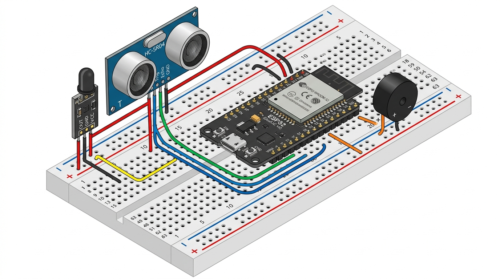

# EcoMemories ESP32 Smart Kiosk & Photobooth — Complete Hardware Guide

Welcome to the definitive hardware construction, wiring, and integration guide for the **EcoMemories Smart Recycling Photobooth Kiosk**.

This guide covers everything required to take your physical components (**ESP32, HC-SR04 Ultrasonic Sensor, Piezo Buzzer, Breadboard, Jumper Wires, 58mm Thermal Printer, and Tablet Screen**) from unboxing to a fully functioning recycling photobooth cabinet.

---

## 1. System Architecture & Dataflow

```text
┌────────────────────────────────────────────────────────────────────────┐
│                        ECOMEMORIES BOOTH CABINET                       │
│                                                                        │
│   ┌──────────────────────────┐                                         │
│   │       TABLET SCREEN      │ ◄─── (Touchscreen mounted on front)     │
│   │  • React Web Application │                                         │
│   │  • Camera Capture        │                                         │
│   └────────────┬─────────────┘                                         │
│                │                                                       │
│                │ Wi-Fi (Local Network / Hotspot)                       │
│                ▼                                                       │
│   ┌──────────────────────────┐         UART Serial (GPIO 17 TX)        │
│   │       ESP32 BOARD        ├─────────────────────────────┐           │
│   │  • Wi-Fi Server (:3333)  │                             │           │
│   │  • Chute Detection Logic │                             │           │
│   └─────┬──────────────┬─────┘                             ▼           │
│         │              │                      ┌──────────────────────┐ │
│         │ GPIO 14      │ GPIO 25              │   THERMAL PRINTER    │ │
│         │ (Trigger)    │ (Buzzer Tone)        │ (58mm ESC/POS Roll)  │ │
│         ▼              ▼                      │ Prints Souvenir Strip│ │
│   ┌───────────┐  ┌───────────┐                └──────────┬───────────┘ │
│   │ ULTRASONIC│  │   PIEZO   │                           │             │
│   │  SENSOR   │  │  BUZZER   │                           │             │
│   │ (HC-SR04) │  │  (Chirps) │                           │             │
│   └───────────┘  └───────────┘                           │             │
│                                                          │             │
│   ┌──────────────────────────────────────────────┐       │             │
│   │ External 5V-9V 2A DC Power Supply ───────────┴───────┘             │
│   │ (Shared Common Ground with ESP32)                                  │
│   └────────────────────────────────────────────────────────────────────┘
│                                                                        │
└───────────────────────────────────┬────────────────────────────────────┘
                                    │
                                    │ Wi-Fi (POST /api/devices/events)
                                    ▼
                     ┌──────────────────────────────┐
                     │     HOST COMPUTER / SERVER   │
                     │  • Laravel API & MySQL DB    │
                     │  • Photostrip Image Storage  │
                     └──────────────────────────────┘
```

---

## 2. Complete Bill of Materials (BOM)

| Component | Specification | Quantity | Role in System |
| :--- | :--- | :---: | :--- |
| **Microcontroller** | ESP32 DevKit V1 (30-pin or 38-pin, ESP-WROOM-32) | 1 | Processes sensor signals, controls buzzer, streams print jobs, and talks to Laravel |
| **Deposit Sensor** | HC-SR04 or HC-SR04P Ultrasonic Transducer | 1 | Detects transparent plastic bottles and metal cans sliding through the chute |
| **Audio Feedback** | Active Piezo Buzzer (5V, continuous tone) | 1 | Emits immediate feedback chirps on item deposit and 3-tone victory fanfare on 5th item |
| **Prototyping Board** | Solderless Breadboard (400 or 830 tie-points) | 1 | Houses the ESP32 and provides shared 5V and Ground power bus rails |
| **Wiring** | 20cm Jumper Wires (10 Male-to-Male, 10 Male-to-Female) | 20 | Connects sensor, buzzer, and printer to the breadboard rails and ESP32 pins |
| **Microcontroller Power** | USB-A to Micro-USB / USB-C Data Cable (minimum 1A rated) | 1 | Supplies stable 5V power to ESP32 and uploads firmware from computer |
| **Thermal Printer** | 58mm POS Printer (Goojprt PT-210, POS-5802DD, or CSN-A2 TTL) | 1 | Prints physical 4-pose Atkinson-dithered photostrip souvenirs with QR code |
| **Print Media** | 58mm Thermal Paper Rolls (or 58mm Adhesive Sticker Rolls) | 2–5 | Heat-sensitive paper (no ink or ribbon required) |
| **Kiosk Display** | Tablet (Android, iPad, or Windows 10/11) | 1 | Interactive kiosk UI, camera capture, session management, and results preview |
| **Printer Power** | 5V–9V 2A DC Power Adapter (if using TTL panel printer) | 1 | Dedicated power for thermal heating elements (built-in battery if using PT-210) |

---

## 3. Breadboard Power Rails & Wiring Architecture

> [!IMPORTANT]
> **Understanding the Breadboard Power Bus:**
> The ESP32 only has two accessible `GND` pins on a breadboard, but you have **three** components requiring ground (**HC-SR04, Buzzer, and Thermal Printer**). 
> **Always use the breadboard power rails:**
> 1. Run a jumper wire from the ESP32 **`GND`** pin to the **Blue/Negative Rail (`-`)**.
> 2. Run a jumper wire from the ESP32 **`VIN`** pin to the **Red/Positive Rail (`+`)**.
> 3. Connect all component `GND` and `VCC` wires into these shared rails!

```
      (+) Red Rail:   [ 5V VIN from ESP32 ] ──────────────► Supplies HC-SR04 VCC
      (-) Blue Rail:  [ GND from ESP32 ]    ──────────────► Shared GND for Sensor, Buzzer, & Printer
```

### 3.1 Visual Wiring Diagram & Breadboard Overview



Based on your physical hardware setup, your ESP32-WROOM-32 (38-Pin USB-C DevKit) spans across the central divider trough from **Row 2 to Row 20**:
* **Left Pins (Column `b`)** are accessed via **Breadboard Column `a`** (Holes `a2` through `a20`).
* **Right Pins (Column `i`)** are accessed via **Breadboard Column `j`** (Holes `j2` through `j20`).
* **Left & Right Power Buses** (`+` Red for 5V, `-` Blue for GND) distribute shared power across all components.

---

### 3.2 Exhaustive 38-Pin Breadboard Coordinate Reference Table

| Row # | Left Hole (`col a`) | Left Silkscreen | GPIO / Function | What Connects Here | Right Hole (`col j`) | Right Silkscreen | GPIO / Function | What Connects Here |
| :---: | :---: | :---: | :---: | :--- | :---: | :---: | :---: | :--- |
| **Row 1** | `a1` | *(empty)* | *(empty breadboard hole)* | *Not connected* | `j1` | *(empty)* | *(empty breadboard hole)* | *Not connected* |
| **Row 2** | `a2` | **`3V3`** | 3.3V Power Out | *Alternative 3.3V power (leave open)* | `j2` | **`GND`** | Ground | *Secondary Ground (leave open)* |
| **Row 3** | `a3` | **`EN`** | Chip Enable / Reset | *Reset button line (do not wire)* | `j3` | **`D23`** | GPIO 23 | *Free GPIO* |
| **Row 4** | `a4` | **`VP`** | GPIO 36 (ADC1_0) | *Analog input only (leave open)* | `j4` | **`D22`** | GPIO 22 | *I2C SCL (leave open)* |
| **Row 5** | `a5` | **`VN`** | GPIO 39 (ADC1_3) | *Analog input only (leave open)* | `j5` | **`TX0`** | GPIO 1 (UART0 TX) | *USB Programming TX (do not wire)* |
| **Row 6** | `a6` | **`D34`** | GPIO 34 (Input only) | *Free Input* | `j6` | **`RX0`** | GPIO 3 (UART0 RX) | *USB Programming RX (do not wire)* |
| **Row 7** | `a7` | **`D35`** | GPIO 35 (Input only) | *Free Input* | `j7` | **`D21`** | GPIO 21 | *I2C SDA (leave open)* |
| **Row 8** | `a8` | **`D32`** | GPIO 32 | *Free GPIO* | `j8` | **`D19`** | GPIO 19 | *HX711 SCK (if scale is attached)* |
| **Row 9** | `a9` | **`D33`** | GPIO 33 | *Free GPIO* | `j9` | **`D18`** | GPIO 18 | *HX711 DOUT (if scale is attached)* |
| **Row 10** | `a10` | **`D25`** | GPIO 25 (PWM Out) | **ACTIVE BUZZER POSITIVE (`+`)** | `j10` | **`D5`** | GPIO 5 | *Free GPIO* |
| **Row 11** | `a11` | **`D26`** | GPIO 26 | *Free GPIO* | `j11` | **`TX2`** | GPIO 17 (UART2 TX) | **THERMAL PRINTER `RX`** (Print Data) |
| **Row 12** | `a12` | **`D27`** | GPIO 27 (Input) | **ULTRASONIC ECHO PIN** *(HC-SR04 only)* | `j12` | **`RX2`** | GPIO 16 (UART2 RX) | **THERMAL PRINTER `TX`** *(Optional status)* |
| **Row 13** | `a13` | **`D14`** | GPIO 14 (I/O) | **IR SENSOR `OUT`** / **ULTRASONIC `TRIG`** | `j13` | **`D4`** | GPIO 4 | *Free GPIO* |
| **Row 14** | `a14` | **`D12`** | GPIO 12 | *Free GPIO (boot-strapping)* | `j14` | **`D2`** | GPIO 2 (Onboard LED) | *Built-in Blue Status LED (already on board)* |
| **Row 15** | `a15` | **`D13`** | GPIO 13 | *Free GPIO* | `j15` | **`D15`** | GPIO 15 | *Free GPIO* |
| **Row 16** | `a16` | **`D9`** | GPIO 9 (SD2) | *Internal Flash memory (do not wire)* | `j16` | **`D8`** | GPIO 8 (SD1) | *Internal Flash memory (do not wire)* |
| **Row 17** | `a17` | **`D10`** | GPIO 10 (SD3) | *Internal Flash memory (do not wire)* | `j17` | **`D7`** | GPIO 7 (SD0) | *Internal Flash memory (do not wire)* |
| **Row 18** | `a18` | **`D11`** | GPIO 11 (CMD) | *Internal Flash memory (do not wire)* | `j18` | **`D6`** | GPIO 6 (CLK) | *Internal Flash memory (do not wire)* |
| **Row 19** | `a19` | **`VIN`** | 5V Power Input/Output | **5V JUMPER TO RED POWER RAIL (`+`)** | `j19` | **`CLK`** | Internal Clock | *Internal Flash (do not wire)* |
| **Row 20** | `a20` | **`GND`** | Ground Return | **GND JUMPER TO BLUE POWER RAIL (`-`)** | `j20` | **`GND`** | Ground Return | *Secondary Ground* |
| **Row 21+** | `a21+` | *(empty)* | *(empty breadboard rows)* | *Free breadboard area for components* | `j21+` | *(empty)* | *(empty breadboard rows)* | *Free breadboard area for components* |

---

### 3.3 Wire-by-Wire Assembly Checklist (Follow in Exact Order)

Grab **8 Dupont jumper wires** (Male-to-Male or Male-to-Female) and follow these exact steps:

```text
===================================================================================================
                               STEP-BY-STEP WIRING PROCEDURE
===================================================================================================

[WIRE 1 - Red Jumper]      Breadboard Hole a19 (VIN)  ────────►  Red Power Rail (+)
[WIRE 2 - Black Jumper]    Breadboard Hole a20 (GND)  ────────►  Blue Ground Rail (-)

[WIRE 3 - Orange Jumper]   Breadboard Hole a10 (D25)  ────────►  Buzzer (+) [Longer leg]
[WIRE 4 - Black Jumper]    Blue Ground Rail (-)       ────────►  Buzzer (-) [Shorter leg]

[WIRE 5 - Red Jumper]      Red Power Rail (+)         ────────►  Sensor VCC Pin
[WIRE 6 - Black Jumper]    Blue Ground Rail (-)       ────────►  Sensor GND Pin
[WIRE 7 - Yellow Jumper]   Breadboard Hole a13 (D14)  ────────►  Sensor OUT Pin (or TRIG)

--- (Only if using 4-Pin Ultrasonic HC-SR04 Sensor) ---
[WIRE 8 - Green Jumper]    Breadboard Hole a12 (D27)  ────────►  HC-SR04 ECHO Pin

--- (Only if using Wired TTL Thermal Printer) ---
[WIRE 9 - White Jumper]    Breadboard Hole j11 (TX2)  ────────►  Thermal Printer RX
[WIRE 10 - Blue Jumper]    Breadboard Hole j12 (RX2)  ────────►  Thermal Printer TX
```

---

### 3.4 Physical Component Details & How to Plug Them In

#### 1. The Active Piezo Buzzer (Audio Feedback)
* **Identifying Polarity**:
  * Look at the top of the black cylinder: there is a small sticker with a **`+`** symbol.
  * Look at the two metal legs: the **longer leg is Positive (`+`)**, and the **shorter leg is Negative (`-`)**.
* **Mounting on the Breadboard**:
  * You can plug the Buzzer directly into the lower empty rows of your breadboard:
    * Plug the **Longer leg (`+`)** into hole **`e23`**.
    * Plug the **Shorter leg (`-`)** into hole **`e24`**.
    * Run a jumper from **`a10`** (ESP32 `D25`) to hole **`a23`**.
    * Run a jumper from the **Blue Ground Rail (`-`)** to hole **`a24`**.

---

#### 2. The IR Obstacle Sensor (Detection Chute)
* **Pin Labels**: On the blue or black PCB, find the 3 pins labeled `VCC`, `GND`, and `OUT`.
* **Connections**:
  * `VCC` $\rightarrow$ Red Rail (`+`)
  * `GND` $\rightarrow$ Blue Rail (`-`)
  * `OUT` $\rightarrow$ Breadboard Hole **`a13`** (`D14`)
* **Sensitivity Calibration (Crucial Step)**:
  * On the sensor board, there is a small rectangular blue component with a silver screw head (the **trimmer potentiometer**).
  * With the ESP32 powered, hold a transparent bottle or plastic cup inside the chute at your desired detection distance (e.g., 5 cm to 10 cm).
  * Use a small screwdriver to turn the potentiometer clockwise until the onboard green indicator LED lights up when the bottle passes, and turns off when the bottle is removed.

---

#### 3. The HC-SR04 Ultrasonic Sensor (Alternative Chute Sensor)
* **Pin Labels**: Facing the two round silver speaker transducers ('T' and 'R'), the 4 pins at the bottom are:
  * `VCC` (Left) $\rightarrow$ Red Rail (`+`)
  * `TRIG` (Center Left) $\rightarrow$ Breadboard Hole **`a13`** (`D14`)
  * `ECHO` (Center Right) $\rightarrow$ Breadboard Hole **`a12`** (`D27`)
  * `GND` (Right) $\rightarrow$ Blue Rail (`-`)
* **Chute Positioning**:
  * Mount the sensor at the top or side of the bottle drop chute pointing diagonally downward.
  * When a bottle falls past the two silver cylinders, the sound echo duration drops dramatically, instantly registering a deposit event!

---

## 4. Pin-by-Pin Connection Matrix

### Recommended Wire Color Conventions
* **Red:** 5V Power (`VIN`)
* **Black:** Ground (`GND`)
* **Yellow:** Trigger Signals (`TRIG` / `GPIO 14`)
* **Green:** Echo Signals (`ECHO` / `GPIO 27`)
* **Orange:** Audio Signal (`Buzzer +` / `GPIO 25`)
* **White / Blue:** Serial Data (`Printer RX` / `GPIO 17`)

---

### Table A: HC-SR04 Ultrasonic Sensor Connections
| Sensor Pin | Wire Type | ESP32 / Breadboard Destination | Description |
| :--- | :---: | :--- | :--- |
| **`VCC`** | Female-to-Male | **Red Rail (`+`)** or ESP32 **`VIN`** (5V) | 5V operational power for the acoustic transducer |
| **`GND`** | Female-to-Male | **Blue Rail (`-`)** or ESP32 **`GND`** | System ground return |
| **`TRIG`** | Female-to-Male | ESP32 **`GPIO 14`** (labeled `D14`) | Receives 10µs sound emission trigger from ESP32 |
| **`ECHO`** | Female-to-Male | ESP32 **`GPIO 27`** (labeled `D27`) | Returns high pulse duration proportional to distance |

> [!TIP]
> **Why Ultrasonic is Superior to Infrared for Recycling:**
> Transparent PET plastic bottles allow infrared light to pass straight through without reflecting back. The HC-SR04 emits 40,000 Hz ultrasound waves that bounce reliably off **every** material, including clear bottles, colored plastics, crushed cans, and cardboard!

---

### Table B: Active Piezo Buzzer Connections
| Buzzer Pin | Wire Type | ESP32 / Breadboard Destination | Description |
| :--- | :---: | :--- | :--- |
| **`Longer Leg (+)`** | Male-to-Male | ESP32 **`GPIO 25`** (labeled `D25`) | Controlled by ESP32 PWM / digital high tone |
| **`Shorter Leg (-)`** | Male-to-Male | **Blue Rail (`-`)** or ESP32 **`GND`** | Common system ground |

---

### Table C: Thermal Printer Options

#### Option 1: Portable Bluetooth POS Printer (e.g., Goojprt PT-210, POS-5802DD) — *Recommended*
* **Wiring to ESP32:** **None needed.**
* **Connection:** Pairs wirelessly via Bluetooth directly to the **Tablet**.
* **Power:** Built-in rechargeable lithium-ion battery (charges via standard USB).
* **Setup on Tablet:**
  1. Turn on printer and enable Bluetooth on the tablet.
  2. Pair with the printer (PIN is usually `0000` or `1234`).
  3. On Android tablets, install **RawBT Print Service** or **ESC POS Print Service** from Google Play.
  4. The EcoMemories web app calls `window.print()`, sending the 58mm dithered strip straight to paper.

#### Option 2: Embedded Panel-Mount TTL Printer (e.g., CSN-A2, QR77)
| Printer Pin | Wire Type | Destination | Critical Instruction |
| :--- | :---: | :--- | :--- |
| **`RX` (Receive)** | Female-to-Male | ESP32 **`GPIO 17`** (`TX2`) | Receives ESC/POS raster print bytes |
| **`TX` (Transmit)** | Female-to-Male | ESP32 **`GPIO 16`** (`RX2`) | Optional status/paper-out signals |
| **`GND`** | Female-to-Male | **Blue Rail (`-`)** & Power Supply **`GND`** | **Must share common ground with ESP32** |
| **`VCC (5V–9V)`** | Power Cable | **External 5V–9V 2A DC Supply** | **NEVER connect to ESP32 pins!** |

> [!CAUTION]
> **Thermal Printer Power Warning:**
> When printing photographs with thousands of heated black dots, thermal printheads draw **1.5A to 2.5A peak current**. 
> Attempting to power a thermal printer from the ESP32's 5V/VIN pin will cause an instant brownout reboot (`Brownout detector was triggered`). Always use a separate 5V–9V 2A DC power adapter for panel printers.

---

## 5. Physical Chute Fabrication & Angle Geometry

To guarantee 100% detection rate when users drop items into the recycling chute, follow these construction recommendations:

```
               BOTTLE INSERTION OPENING
                      ┌─────────┐
                      │  ( 🍾 ) │
                      │         │
    Sensor Mount ──► 📡  \       \  Chute walls: Smooth plastic, wood, or acrylic
    (Angled at 35°)       \       \
                           \       \  Slide slope: 35° to 45°
                            \       \ (Ensures bottle slides past sensor in ~250ms)
                             \       \
                              └─────────► TO COLLECTION RECEPTACLE
```

1. **Slide Angle (Slope):** Set the chute floor at a **35° to 45° angle**. This allows gravity to slide the bottle down smoothly without tumbling too fast for the ultrasonic ping.
2. **Sensor Mounting Distance:** Mount the HC-SR04 transducer **5 cm to 10 cm above the sliding floor**.
3. **Internal Chute Width:** Make the chute 12 cm to 15 cm wide. This fits 330ml soda cans up to 1.5L plastic bottles while preventing items from twisting sideways.
4. **Debounce Logic:** The firmware has a built-in `DEPOSIT_DEBOUNCE_MS 2000` (2 seconds). Once a bottle is detected, additional vibrations or rolling are ignored for 2 seconds to prevent double-counting.

---

## 6. Firmware Configuration Guide (`config.h`)

All project configurations are centralized in [`firmware/esp32/esp32_kiosk_controller/config.h`](file:///c:/xampp/htdocs/EcoMemories-Website/firmware/esp32/esp32_kiosk_controller/config.h). Open this file in your editor or Arduino IDE and update the following settings:

### Step 1: Set Sensor Mode to Ultrasonic
```c
// Line 33:
#define SENSOR_MODE_IR        0     // 0 = HC-SR04 Ultrasonic (1 = IR Obstacle)
#define PROXIMITY_PIN         14    // Connects to HC-SR04 TRIG pin
#define ULTRASONIC_ECHO_PIN   27    // Connects to HC-SR04 ECHO pin
```

### Step 2: Configure Wi-Fi Credentials
```c
// Line 14-15:
#define WIFI_SSID             "EcoMemories-Booth"   // 2.4GHz Wi-Fi or Phone Hotspot
#define WIFI_PASSWORD         "your_password_here"
```

> [!NOTE]
> The ESP32 only supports **2.4 GHz Wi-Fi**. If using a dual-band home router or mobile hotspot, make sure the 2.4 GHz band is enabled.

### Step 3: Configure Backend API Endpoint
```c
// Line 22-23:
// Set this to your laptop/server's local network IP (e.g., 192.168.1.100)
#define LARAVEL_EVENT_URL     "http://192.168.1.100:8000/api/devices/events"
#define DEVICE_ID             "ESP32-001"
#define DEVICE_SECRET         ""    // Leave empty if not enforced in .env
```

---

## 7. Step-by-Step Code Upload Guide

### Upload Method 1: Using Arduino IDE
1. Run [`launch_arduino.bat`](file:///c:/xampp/htdocs/EcoMemories-Website/firmware/esp32/esp32_kiosk_controller/launch_arduino.bat) to launch the IDE with proper clean temporary directories.
2. Connect your ESP32 to the PC using your data cable.
3. In Arduino IDE:
   * **Tools $\rightarrow$ Board $\rightarrow$ esp32 $\rightarrow$ ESP32 Dev Module**
   * **Tools $\rightarrow$ Port $\rightarrow$ Select your COM port** (e.g., `COM3`, `COM4`, `COM7`)
   * **Tools $\rightarrow$ Upload Speed $\rightarrow$ 921600** (or `115200`)
4. Click the **Upload** button ($\rightarrow$).

> [!TIP]
> **If the IDE console hangs on `Connecting........_____.....`:**
> Press and hold the physical **`BOOT`** button on your ESP32 board for 2 seconds until the writing progress percentage begins (`Writing at 0x00010000... (10%)`), then release the button.

---

### Upload Method 2: One-Click Command Line Verification
You can compile and verify the entire firmware suite at any time from PowerShell:
```powershell
cmd /c "c:\xampp\htdocs\EcoMemories-Website\firmware\esp32\esp32_kiosk_controller\compile_esp32.bat"
```

---

## 8. Verification & Live Testing Checklist

Follow these 4 phases to verify every component step by step:

```text
┌─────────────────────────┐
│        PHASE 1          │
│ Serial Monitor & Wi-Fi  │
└────────────┬────────────┘
             │
             ▼
┌─────────────────────────┐
│        PHASE 2          │
│ Sensor Wave & Buzzer    │
└────────────┬────────────┘
             │
             ▼
┌─────────────────────────┐
│        PHASE 3          │
│ Tablet Polling & Fanfare│
└────────────┬────────────┘
             │
             ▼
┌─────────────────────────┐
│        PHASE 4          │
│ Capture & Thermal Print │
└─────────────────────────┘
```

### Phase 1: Serial Monitor & Network Link
1. In Arduino IDE, open **Tools $\rightarrow$ Serial Monitor** and set baud rate to **115200**.
2. Press the `EN` (Reset) button on the ESP32.
3. Confirm output matches:
   ```text
   ╔═════════════════════════════════════════════╗
   ║   EcoMemories ESP32 Smart Kiosk Firmware    ║
   ╚═════════════════════════════════════════════╝
   [INIT] Thermal Printer disabled (digital receipts on screen & Serial).
   [INIT] Weight sensor disabled (single sensor item counting mode).
   [WIFI] Connecting to SSID: EcoMemories-Booth...
   [WIFI] ✓ Connected! IP Address: 192.168.1.120
   [SERVER] ✓ Local Kiosk Server listening on http://192.168.1.120:3333
   ```
4. Note the printed IP address (e.g. `192.168.1.120`).

---

### Phase 2: Ultrasonic Detection & Audio Feedback
1. Hold a plastic bottle or your hand **8 cm** in front of the HC-SR04 transducers.
2. The buzzer will emit a crisp 100ms tone.
3. The Serial Monitor will output:
   ```text
   [SENSOR] Object detected! Measured weight: 18.0g
   ```
4. Verify the 2-second debounce: keeping your hand there does not trigger repeat deposits.

---

### Phase 3: Tablet Live Polling & Fanfare
1. On your tablet, navigate to `http://<your-laptop-ip>:8000`.
2. Tap **"Start Recycling Session"**.
3. Deposit 5 recyclable bottles or cans:
   * **Deposits 1 to 4:** The buzzer beeps once; the on-screen progress ring advances from `1/5` to `4/5` automatically every 2 seconds without refreshing.
   * **Deposit 5:** The buzzer plays a **3-tone victory fanfare**, confetti bursts on the tablet screen, and the camera unlocks!

---

### Phase 4: Souvenir Printing
1. Complete the 4 photo poses on the tablet.
2. On the **Results Page**:
   * Toggle **"Thermal Print (58mm)"** to inspect the clean white-paper Atkinson dithered portrait with high-contrast facial features.
   * Tap **"Print Photostrip Souvenir"**.
   * The tablet streams the dithered raster bit image directly to the thermal printer, outputting the physical souvenir strip!

---

## 9. Comprehensive Troubleshooting Matrix

| Symptom | Probable Cause | Exact Solution |
| :--- | :--- | :--- |
| **`Connecting........_____` during upload** | ESP32 bootloader pin held high by serial chip | Hold down the physical `BOOT` button on the ESP32 until the upload starts. |
| **Buzzer does not make sound** | Polarity reversed or wrong pin | Check that the longer leg `(+)` is in `GPIO 25` and the shorter leg `(-)` is in the ground rail. |
| **Ultrasonic sensor triggers continuously** | False echoes bouncing off inner chute walls | Angle the HC-SR04 downward into the chute at 35°. Ensure `TRIG` is in `GPIO 14` and `ECHO` is in `GPIO 27`. |
| **Printer outputs blank white paper** | Thermal paper roll inserted backwards | Thermal paper is heat-sensitive on only one side. Open the lid, turn the roll upside down, and close. |
| **ESP32 reboots when print starts** | Brownout caused by inadequate power | Do not power printer from ESP32. Use an external 5V–9V 2A power supply with shared ground. |
| **Tablet says "Bridge Disconnected"** | Tablet and ESP32 are on different subnets | Ensure both the tablet and ESP32 are connected to the exact same Wi-Fi router or mobile hotspot. |
| **Printed picture looks too dark/muddy** | Old Floyd-Steinberg algorithm applied | The firmware and web app are now updated with Atkinson dithering and portrait gamma correction ($\gamma = 0.68$). Ensure your browser cache is refreshed. |
